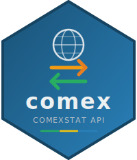

# comexr 

<!-- badges: start -->
[](https://lifecycle.r-lib.org/articles/stages.html#experimental)
[](https://CRAN.R-project.org/package=comexr)
[](https://opensource.org/licenses/MIT)
<!-- badges: end -->

The **comexr** package provides a complete R interface to the [ComexStat API](https://api-comexstat.mdic.gov.br/docs#/) from the Brazilian Ministry of Development, Industry, Trade and Services (MDIC). It allows programmatic access to detailed Brazilian export and import data.

## Features

- **30 functions** covering all API endpoints
- **General trade data** (1997–present), **city-level** data, and **historical** records (1989–1996)
- **Auxiliary tables**: countries, economic blocs, NCM/NBM/HS product codes, CGCE/SITC/ISIC classifications, states, cities, transport modes, customs units
- **Only 2 dependencies**: `httr2` + `cli`
- **Multilingual**: Portuguese, English, Spanish
- **SSL auto-fallback**: handles ICP-Brasil certificate issues transparently

## Installation

```r
# Install from GitHub
# install.packages("remotes")
remotes::install_github("StrategicProjects/comexr")
```

## Quick Start

```r
library(comexr)

# Exports by country in January 2024 (monthly detail by default)
exports <- comex_export(
  start_period = "2024-01",
  end_period = "2024-01",
  details = "country"
)

# Imports with CIF value
imports <- comex_import(
  start_period = "2024-01",
  end_period = "2024-12",
  details = "country",
  metric_cif = TRUE
)

# Filter: exports to China (160), grouped by HS4
soy <- comex_export(
  start_period = "2024-01",
  end_period = "2024-12",
  details = c("country", "hs4"),
  filters = list(country = 160)
)
```

## Discover available options

```r
# What grouping fields are available?
comex_details("general")

# What filters can I use?
comex_filters("general")

# Look up country codes
countries <- comex_countries()
countries[grepl("China", countries$text, ignore.case = TRUE), ]

# Economic blocs in Portuguese
comex_blocs(language = "pt")
```

## API Coverage

### Query Functions

| Function | Description |
|----------|-------------|
| `comex_query()` | General foreign trade query |
| `comex_export()` | Shortcut for export queries |
| `comex_import()` | Shortcut for import queries |
| `comex_query_city()` | City-level data query |
| `comex_historical()` | Historical data (1989-1996) |

### Metadata Functions

| Function | Description |
|----------|-------------|
| `comex_last_update()` | Last data update date |
| `comex_available_years()` | Available years for queries |
| `comex_filters()` | Available filters |
| `comex_filter_values()` | Values for a specific filter |
| `comex_details()` | Available detail/grouping fields |
| `comex_metrics()` | Available metrics |

### Auxiliary Tables

| Function | Description |
|----------|-------------|
| `comex_countries()` / `comex_country_detail()` | Countries |
| `comex_blocs()` | Economic blocs |
| `comex_states()` / `comex_state_detail()` | Brazilian states |
| `comex_cities()` / `comex_city_detail()` | Brazilian cities |
| `comex_transport_modes()` / `comex_transport_mode_detail()` | Transport modes |
| `comex_customs_units()` / `comex_customs_unit_detail()` | Customs units |
| `comex_ncm()` / `comex_ncm_detail()` | NCM codes |
| `comex_nbm()` / `comex_nbm_detail()` | NBM codes (historical) |
| `comex_hs()` | Harmonized System |
| `comex_cgce()` | CGCE (BEC) classification |
| `comex_sitc()` | SITC classification |
| `comex_isic()` | ISIC classification |

## SSL Certificate Issues

On some systems the API's ICP-Brasil certificate chain is not recognized. The package handles this automatically — on the first failure it retries without SSL verification and issues a warning. To suppress:

```r
options(comex.ssl_verifypeer = FALSE)
```

## References

- [ComexStat](https://comexstat.mdic.gov.br/en/home) — Brazilian foreign trade statistics
- [ComexStat API Docs](https://api-comexstat.mdic.gov.br/docs) — Official API documentation
- [MDIC](https://www.gov.br/mdic/pt-br) — Ministry of Development, Industry, Trade and Services

## License

MIT © comexr authors
